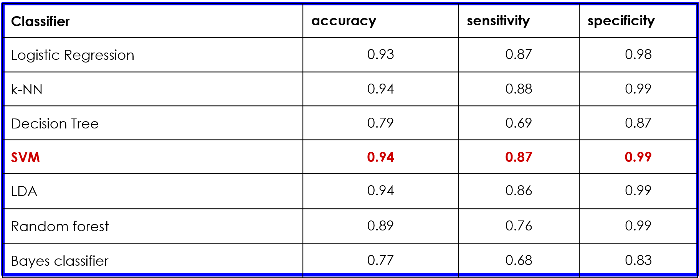
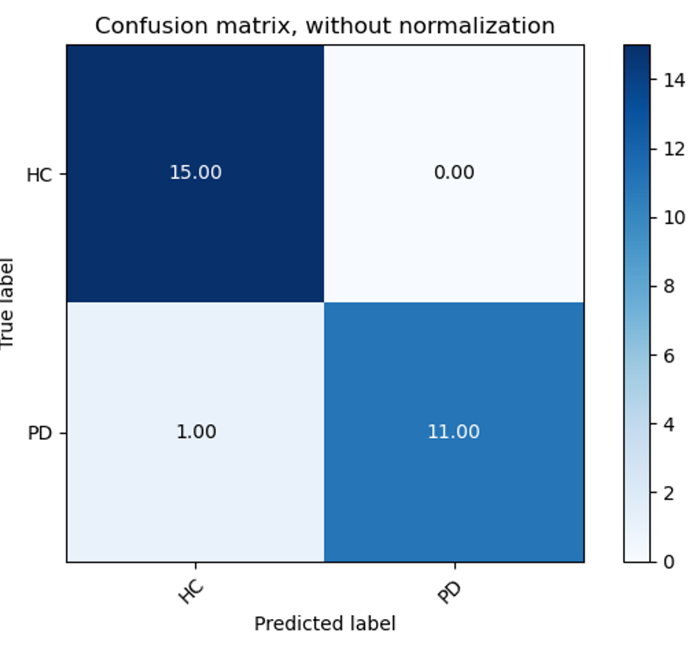
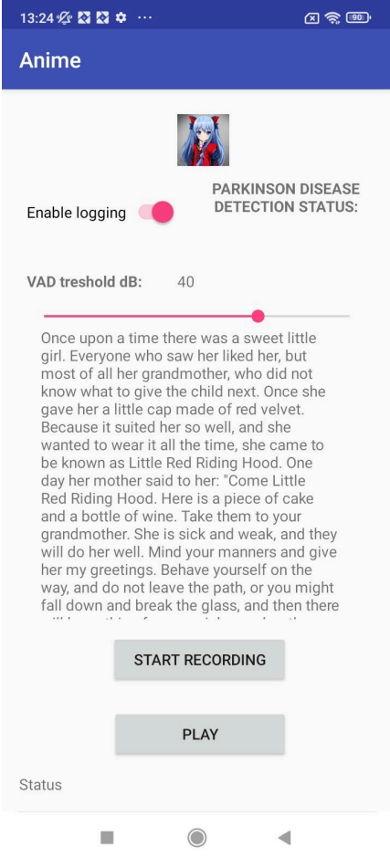

# Определение возможности заболевания болезнью Паркинсона по речевым признакам с помощью Android-приложения

## Данный командный проект разрабатывался в рамках дисциплины "Проектирование пайплайна"

**Целью** работы является разработка мобильного приложения, которое
способно детектировать болезнь Паркинсона на основе анализа голосовых
данных.

Для **достижения** поставленной цели в ходе выполнения данной работы
были выполнены следующие задачи:

- Аугментация и предобработка аудиозаписей из датасета
- Детектирование времени начала и окончания чтения
- Анализ акустических признаков
- Создание и обучение классификатора
- Интеграция классификатора в приложение
- Тестирование и отладка приложения

## Результаты

Результаты в задаче распознавания болезни Паркинсона по голосу показали: 

В результате был выбран SVM классификатор. Матрица неточности по людям

где HC - здоровый, PD - болезнь Паркинсона

### Подробные результаты, актуальность и прочую информацию вы можете найти в расчетно-пояснительной записке и в презентации

## Скриншот из приложения

## Структура проекта

Данные для обучения в силу своего размера не добавлены в данный репозиторий. 

- [*PythonScripts/*](./PythonScripts) - папка со скриптами обучения, аугментации и выделения признаков

- [*Report/*](./Report) - папка с отчетом по командному проекту.

- [*SpeechRecognitionAndroid/*](./SpeechRecognitionAndroid) - папка с файлами проекта приложения.

- [*buildInstructions.txt*](./buildInstructions.txt) - инструкция по настройке и сборе проекта в Android Studio.

- [*versions.txt*](./versions.txt) - используемые версии gradle, android sdk и python.